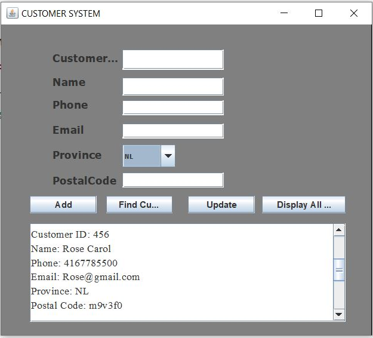

# JavaProject

# In this JAVA project.I Implemented a 3 tier package to classify the classes in section.Under the scr folder, I have Business, Data and presentation.
# Project can be executed from the MAIN class in the presentation package.
# Made a customer record GUI application that can ADD, FIND, UPDATE and DISPLAY all customers data into a binary / text file.  
 
 

